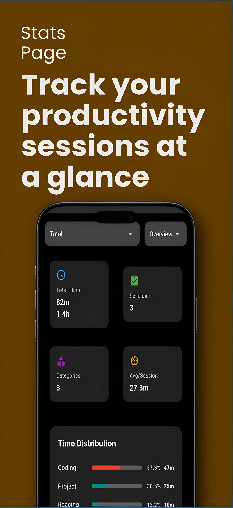

# ⏱️ Timed Productivity – Pomodoro App

A minimal, black-themed **Pomodoro timer** app built to help you focus, track productivity, and organize tasks into categories.  
Simple design • Useful stats • Open-source  

---

## ✨ Features
- 🎯 **Clean Focus Timer** – Start focus & break sessions with a distraction-free interface  
- 📊 **Productivity Stats** – Track completed sessions at a glance  
- 📈 **Detailed Analytics** – Dive into your focus & break history  
- 🗂️ **Categories** – Create custom categories to organize your work  

---

## 📸 Screenshots

  
  
  
  

---

## 🛠️ Tech Stack

- Flutter (Dart)
- Provider (state management)
- Hive (local database)

---

## 🤝 Contributing

Contributions, issues, and feature requests are welcome!
Feel free to check the issues page
